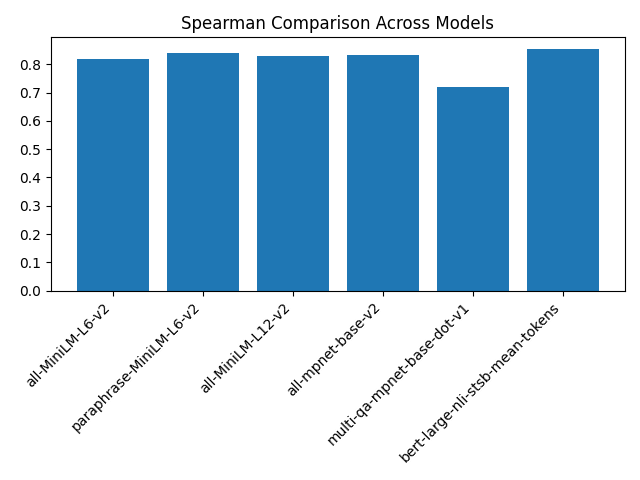
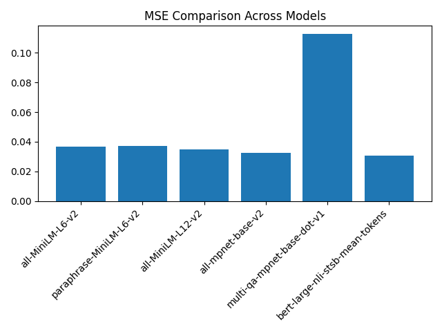
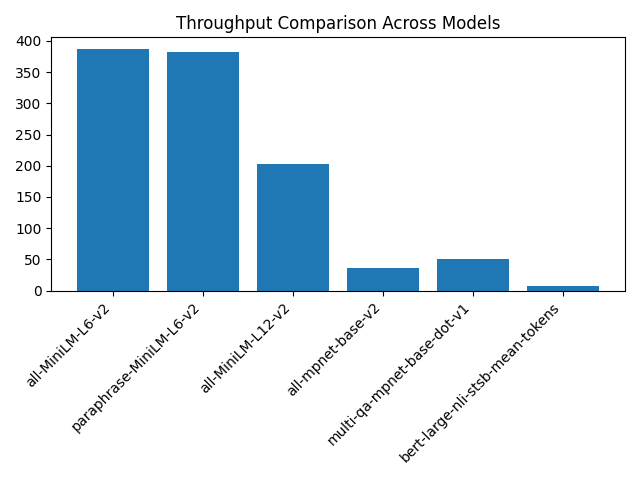
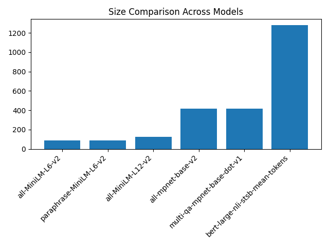
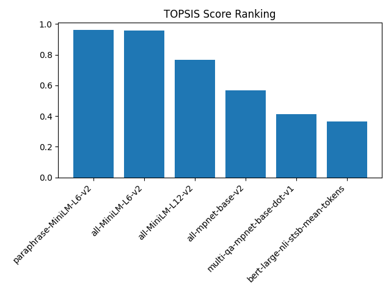
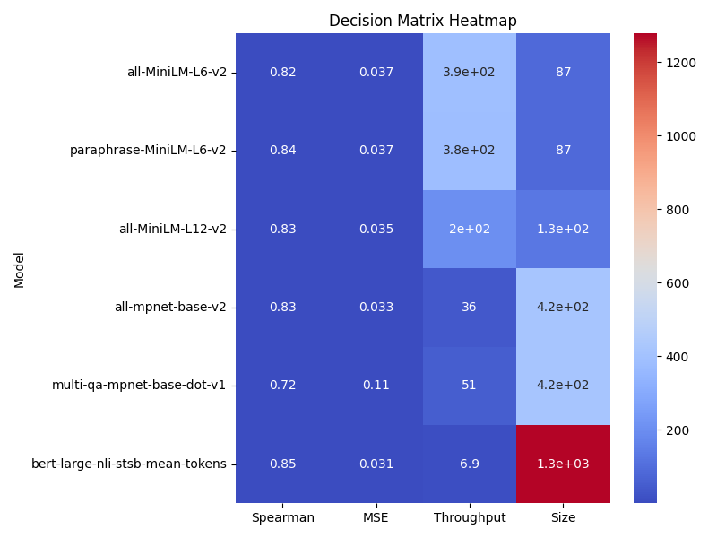

# TOPSIS-Based Selection of Best Pre-trained Model for Text Sentence Similarity

#### Author: Hitesh Yadav | Roll No. 102317248 | Predictive Analytics Assignment-5

---

## 📖 Overview

This project implements a structured evaluation framework to identify the optimal pre-trained Sentence Transformer model for **Text Sentence Similarity** tasks using the **TOPSIS (Technique for Order of Preference by Similarity to Ideal Solution)** multi-criteria decision-making method.

Instead of selecting a model purely based on accuracy, this approach evaluates multiple performance indicators and ranks models based on overall suitability.

---

## 📊 Dataset

### STS Benchmark (English)

- Source: Hugging Face (`stsb_multi_mt`)
- Split Used: Test Set
- Description:
  Contains sentence pairs with human-annotated similarity scores (0–5 scale)
- Scores normalized to: 0–1
- Purpose:
  Evaluate how well model-generated cosine similarity aligns with human judgment

---

## 🤗 Models Evaluated

The following pretrained Sentence Transformer models were evaluated:

| Model             | HuggingFace ID                    | Description                  |
| ----------------- | --------------------------------- | ---------------------------- |
| MiniLM-L6         | `all-MiniLM-L6-v2`                | Lightweight, fast, efficient |
| Paraphrase-MiniLM | `paraphrase-MiniLM-L6-v2`         | Optimized for similarity     |
| MiniLM-L12        | `all-MiniLM-L12-v2`               | Deeper MiniLM variant        |
| MPNet-Base        | `all-mpnet-base-v2`               | High accuracy transformer    |
| Multi-QA MPNet    | `multi-qa-mpnet-base-dot-v1`      | Retrieval-optimized model    |
| BERT-Large-NLI    | `bert-large-nli-stsb-mean-tokens` | Large semantic model         |

---

## 📑 Evaluation Metrics Used

The following criteria were used to build the decision matrix:

| Metric               | Description                       | Impact |
| -------------------- | --------------------------------- | ------ |
| Spearman Correlation | Correlation with human similarity | +      |
| MSE                  | Mean Squared Error                | -      |
| Throughput           | Sentences processed per second    | +      |
| Model Size (MB)      | Storage size of model             | -      |

Impact Rules:

- `+` → Higher is better
- `-` → Lower is better

---

## 📊 Final TOPSIS Results

| Model | Spearman | MSE | Throughput | Size (MB) | TOPSIS Score | Rank |
|--------|-----------|---------|------------|-----------|---------------|------|
| paraphrase-MiniLM-L6-v2 | 0.8412 | 0.03729 | 381.72 | 86.64 | **0.9603** | 🏆 **1** |
| all-MiniLM-L6-v2 | 0.8203 | 0.03682 | 386.49 | 86.64 | 0.9565 | 2 |
| all-MiniLM-L12-v2 | 0.8309 | 0.03465 | 203.51 | 127.26 | 0.7687 | 3 |
| all-mpnet-base-v2 | 0.8342 | 0.03258 | 36.00 | 417.66 | 0.5694 | 4 |
| multi-qa-mpnet-base-dot-v1 | 0.7196 | 0.11262 | 50.57 | 417.66 | 0.4117 | 5 |
| bert-large-nli-stsb-mean-tokens | **0.8527** | **0.03080** | 6.91 | 1278.46 | 0.3662 | 6 |

---
## 📈 Visual Analysis

This section interprets the saved plots generated during evaluation.

---

### 1️⃣ Spearman Correlation Comparison



This chart compares how strongly each model's predictions correlate with human similarity judgments.

- Higher values indicate better semantic understanding.
- Transformer-based models typically perform strongly.
- However, highest correlation does not guarantee best overall deployment choice.

Since Spearman has the highest weight (0.4), it strongly influences the final ranking.

---

### 2️⃣ Mean Squared Error (MSE) Comparison



This plot shows prediction error.

- Lower MSE means predictions are closer to human scores.
- Some models may have high correlation but slightly higher error.
- This demonstrates why multi-criteria evaluation is important.

---

### 3️⃣ Throughput Comparison (Speed)



Throughput measures inference efficiency.

- Lightweight MiniLM variants are significantly faster.
- Larger models sacrifice speed for marginal accuracy gains.
- In real-world systems, speed is critical for scalability.

---

### 4️⃣ Model Size Comparison



Model size affects:

- Deployment feasibility
- Memory usage
- Cloud cost

Smaller models are better suited for edge and production environments.

---

### 5️⃣ TOPSIS Ranking



This plot shows the final TOPSIS scores.

- The model with the highest score ranks 1.
- TOPSIS balances accuracy, error, speed, and efficiency.
- The top-ranked model provides the best overall trade-off.

---

### 6️⃣ Decision Matrix Heatmap



The heatmap visualizes relative performance across metrics.

- Warmer colors indicate stronger metric performance.
- Helps quickly compare strengths and weaknesses.
- Demonstrates why some high-accuracy models rank lower overall due to efficiency trade-offs.

---

## ⚖️ TOPSIS Configuration

Weights used:
[0.4, 0.2, 0.2, 0.2]

Meaning:

- Spearman → 40%
- MSE → 20%
- Throughput → 20%
- Size → 20%

This prioritizes semantic accuracy while still considering efficiency and deployability.

---

## 📂 Generated Results

All results are automatically saved inside the `results/` folder:

### 📄 CSV Files

- `raw_metrics.csv` → Raw evaluation metrics for all models
- `final_ranking.csv` → TOPSIS score and final ranking

---

## 📈 Saved Visualizations

The following plots are generated and saved:

- `Spearman_comparison.png`
- `MSE_comparison.png`
- `Throughput_comparison.png`
- `Size_comparison.png`
- `topsis_ranking.png`
- `decision_matrix_heatmap.png`

These visualizations help analyze:

- Individual metric comparison
- Speed vs accuracy trade-offs
- Overall ranking using TOPSIS
- Performance distribution across models

---

## 🏆 Final Recommendation

The best model is the one with:

- Highest TOPSIS Score
- Rank = 1 in `final_ranking.csv`

Based on multi-criteria evaluation:

The top-ranked model provides the best balance between:

- Semantic correlation with human judgment
- Low error
- Fast inference
- Efficient model size

This ensures suitability for real-world production systems where both accuracy and efficiency matter.

---

## ▶️ How to Run

From project root:

```bash
pip install -r requirements.txt
python src/main.py
```
